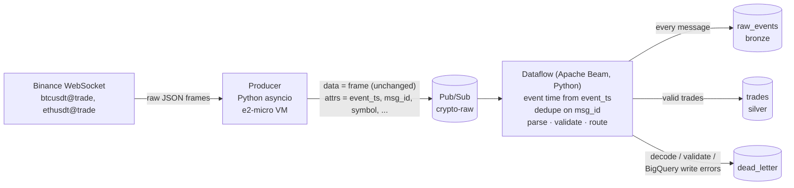

# gcp_streaming_dataflow

Real-time ingestion of **Binance spot trades** into **BigQuery** on Google Cloud, built
to showcase streaming data engineering: WebSocket ingestion, decoupling with Pub/Sub,
event-time processing and de-duplication in **Apache Beam on Dataflow**, a
bronze/silver/dead-letter data model, and infrastructure as code with Terraform.
Everything runs in `europe-west6` (Zurich) and is designed to run in *sessions*
so the bill stays near zero when you're not using it.



## What's in the box

| Path | What it is |
|---|---|
| `producer/producer.py` | Async WebSocket client → Pub/Sub. Reconnects with backoff + jitter, rotates connections before Binance's 24 h limit, staleness watchdog, publisher batching and flow control (backpressure), graceful flush on shutdown. |
| `producer/startup.sh` | VM startup script: pulls the latest producer code from GCS on every boot and runs it under systemd. |
| `pipeline/crypto_pipeline/` | Beam pipeline: `parsing.py` (pure-Python business rules), `transforms.py` (DoFn + Storage Write API sinks), `pipeline.py` (graph + options). |
| `pipeline/crypto_pipeline/schemas/*.json` | BigQuery schemas - **single source of truth** used by both Terraform and the pipeline. |
| `pipeline/Dockerfile` | One image for the Flex Template launcher *and* the Dataflow workers. |
| `infra/terraform/` | Pub/Sub, BigQuery, GCS, Artifact Registry, VPC + firewall, service accounts with least-privilege IAM, producer VM, **budget alert**. |
| `scripts/`, `Makefile` | `make bootstrap / infra / build / up / down / status / logs / destroy`. |
| `tests/` | Unit tests for parsing rules, producer message building, the reconnect loop, and the Beam DoFn. |

## Quick start

Prerequisites: `gcloud`, `terraform >= 1.6`, `python3 >= 3.11`, `make`, a billing account.
Docker is **not** needed - images are built in Cloud Build.

```bash
# 0. Configure
cp config.env.example config.env        # set PROJECT_ID and BILLING_ACCOUNT
gcloud auth login
gcloud auth application-default login   # credentials Terraform uses

# 1. One-time: project, billing link, Terraform state bucket
make bootstrap

# 2. One-time (re-run after infra changes): all cloud resources
make infra

# 3. Build the pipeline image + Flex Template (re-run after pipeline changes)
make build

# 4. Stream!  ...and ALWAYS stop the session when done
make up
make status      # VM / Dataflow state + rows landed in the last 15 min
make down
```

Try the producer locally first, without any GCP resources:

```bash
make producer-local    # prints 20 live trades with their Pub/Sub attributes
make test
```

> **Project id:** GCP project ids can't contain underscores, so the project is
> `gcp-streaming-dataflow` (add a suffix if that's taken globally). The GitHub repo
> can keep the name `gcp_streaming_dataflow`.

## Keeping the bill low

| State | What's billed | Rough cost* |
|---|---|---|
| **Session running** (`make up`) | Dataflow worker (1 × n1-standard-2, Streaming Engine), e2-micro VM + ephemeral IP, Pub/Sub, BigQuery Storage Write | ≈ $0.20-0.30 / hour |
| **Idle** (`make down`) | Stopped VM's 10 GB disk, GCS, BigQuery storage (30-day partition expiry) | < $1 / month |

\*Estimates for europe-west6; check the [pricing calculator](https://cloud.google.com/products/calculator)
and your billing reports. Dataflow is by far the biggest item, so the $20 budget buys
roughly 70-100 session hours.

Cost controls built in:

- **`make up` / `make down`**: `down` stops the producer VM first, then *drains* the
  Dataflow job so every in-flight message still lands in BigQuery. Unprocessed
  messages wait in the subscription (1-day retention) for the next session.
- **Budget alert** (`infra/terraform/budget.tf`): emails at 50 %, 90 %, 100 % actual and
  100 % forecasted spend. Budgets *alert only* - they never stop resources.
- Dataflow pinned to **1 worker**, autoscaling capped at 1.
- The VM is created **stopped**; nothing runs until `make up`.
- BigQuery partitions expire after 30 days; GCS temp files after 7 days; old images
  are cleaned out of Artifact Registry.

Try `DATAFLOW_MACHINE_TYPE=n1-standard-1` in `config.env` to roughly halve the hourly
cost if the job keeps up (watch memory: Python + Java harness share the worker).

## Design decisions

**Producer on a VM, not serverless.** A WebSocket is a long-lived, stateful connection.
Cloud Run/Functions are built for request/response and would need always-on CPU
(≈ $40+/month); an `e2-micro` costs a few dollars a month and can be stopped between
sessions. The free-tier e2-micro exists only in US regions, which Binance blocks.

**The producer is a dumb pipe.** It forwards each frame byte-for-byte and only adds
attributes. All validation lives in Beam, where it's unit-tested and replayable from
the bronze table. A parsing bug never loses data.

**Event time from the exchange.** The producer sets `event_ts` to the Binance trade time
`T`; Beam reads it via `timestamp_attribute`, so the Dataflow watermark follows exchange
time, not arrival time. This is the foundation for correct event-time windows (VWAP,
moving averages) and late-data handling later. Events without a timestamp fall back to
producer receive time.

**De-duplication.** Pub/Sub is at-least-once, and reconnects can replay frames. The
producer sets a deterministic `msg_id` (`binance:BTCUSDT:trade:<trade id>`) and Dataflow
drops duplicates with `id_label`. Combined with the **Storage Write API in at-least-once
mode** (cheaper than exactly-once), BigQuery can still see rare duplicates (e.g. worker
retries), so analytics should dedupe on `(symbol, trade_id)` - see the queries below.

**Bronze / silver / dead letter.**

| Table | Contents | Partitioned by | Clustered by |
|---|---|---|---|
| `raw_events` | Every message, original payload as STRING (`PARSE_JSON(payload)` to query) | `ingest_ts` | `event_type, symbol` |
| `trades` | Validated trades; prices/quantities as `NUMERIC` (no float rounding in VWAP) | `trade_time` | `symbol` |
| `dead_letter` | Failed messages with `error_stage` = `decode` / `route` / `validate` / `bq_write` | `processing_ts` | `error_stage` |

The pipeline never crashes on bad data: anything that can't be parsed, fails validation,
or is rejected by BigQuery ends up in `dead_letter` with the original payload.

**Flex Template with a custom container.** The Python Storage Write API is a
cross-language (Java) transform, so the launcher needs a JRE. The same image doubles as
the worker image, so workers start with all dependencies preinstalled.

**One topic for all streams.** Adding `bookTicker` (best bid/ask) later is a config
change (`STREAMS=trade,bookTicker`), a parse function and a table - no new topics or
subscriptions.

## Useful queries

```sql
-- Latest trades, de-duplicated (at-least-once delivery => dedupe in analytics)
SELECT *
FROM `crypto_streaming.trades`
WHERE trade_time > TIMESTAMP_SUB(CURRENT_TIMESTAMP(), INTERVAL 1 HOUR)
QUALIFY ROW_NUMBER() OVER (PARTITION BY symbol, trade_id ORDER BY processing_time) = 1
ORDER BY trade_time DESC
LIMIT 100;

-- End-to-end latency: exchange -> producer -> BigQuery
SELECT symbol,
       APPROX_QUANTILES(TIMESTAMP_DIFF(ingest_time, trade_time, MILLISECOND), 100)[OFFSET(50)] AS p50_exchange_to_producer_ms,
       APPROX_QUANTILES(TIMESTAMP_DIFF(processing_time, trade_time, MILLISECOND), 100)[OFFSET(50)] AS p50_exchange_to_dataflow_ms,
       APPROX_QUANTILES(TIMESTAMP_DIFF(processing_time, trade_time, MILLISECOND), 100)[OFFSET(99)] AS p99_exchange_to_dataflow_ms
FROM `crypto_streaming.trades`
WHERE trade_time > TIMESTAMP_SUB(CURRENT_TIMESTAMP(), INTERVAL 1 HOUR)
GROUP BY symbol;

-- Throughput per second
SELECT TIMESTAMP_TRUNC(trade_time, SECOND) AS second, symbol, COUNT(*) AS trades
FROM `crypto_streaming.trades`
WHERE trade_time > TIMESTAMP_SUB(CURRENT_TIMESTAMP(), INTERVAL 10 MINUTE)
GROUP BY 1, 2 ORDER BY 1 DESC;

-- Gaps in trade ids = data loss check (Binance trade ids are sequential per symbol)
SELECT symbol, trade_id, next_id - trade_id - 1 AS missing
FROM (
  SELECT DISTINCT symbol, trade_id,
         LEAD(trade_id) OVER (PARTITION BY symbol ORDER BY trade_id) AS next_id
  FROM `crypto_streaming.trades`
  WHERE trade_time > TIMESTAMP_SUB(CURRENT_TIMESTAMP(), INTERVAL 1 HOUR)
)
WHERE next_id - trade_id > 1;

-- What went wrong?
SELECT error_stage, error_message, COUNT(*) AS n
FROM `crypto_streaming.dead_letter`
WHERE processing_ts > TIMESTAMP_SUB(CURRENT_TIMESTAMP(), INTERVAL 1 DAY)
GROUP BY 1, 2 ORDER BY n DESC;
```

Expect id gaps between sessions (the producer is stopped) and around reconnects.

## Operations

| Command | Use it for |
|---|---|
| `make status` | VM state, Dataflow jobs, row counts and latency for the last 15 min |
| `make logs` | Producer logs (msgs/s, reconnects, publish errors) from Cloud Logging |
| `make ssh` | Shell on the VM via IAP (`sudo journalctl -u producer -f`) |
| Dataflow console | Job graph, system lag, data freshness, custom metrics (`crypto/messages_in`, `crypto/trades_ok`, `crypto/dead_lettered_*`, `crypto/trade_to_processing_ms`) |

Changing the producer: edit `producer/producer.py`, then `make infra` (uploads the new code)
and restart the VM (`make down && make up`, or `make ssh` + `sudo google_metadata_script_runner startup`).

Changing the pipeline: `make build`, then `make down` (wait for *Drained*) and `make up`.

## Troubleshooting

- **No data in `trades` but the VM is running:** `make logs`. A `451` or connection
  refused from Binance means a blocked region - keep everything in `europe-west6`.
- **Dataflow job fails at launch:** open the job in the console → *Logs* → *Job logs*.
  Missing permissions usually show up there by role name.
- **`make infra` fails on the budget:** you need *Billing Account Administrator* or
  *Billing Account Costs Manager* on the billing account.
- **Subscription backlog grows:** the worker can't keep up - use a bigger
  `DATAFLOW_MACHINE_TYPE` or raise `--max-workers` in `scripts/up.sh`.

## Teardown

```bash
make destroy                                   # all resources except project + state bucket
gcloud projects delete gcp-streaming-dataflow  # everything, including the project
```

## Roadmap

- Event-time **VWAP** and moving averages with tumbling/sliding windows, allowed lateness and triggers.
- REST backfill of trade-id gaps after producer reconnects (design: [docs/roadmap-rest-backfill.md](docs/roadmap-rest-backfill.md)).
- `bookTicker` stream (best bid/ask) for spreads and mid-price.
- Cloud Monitoring dashboard + alerting (subscription backlog, system lag, dead-letter rate).
- CI (GitHub Actions): tests, `terraform validate`, image build.
